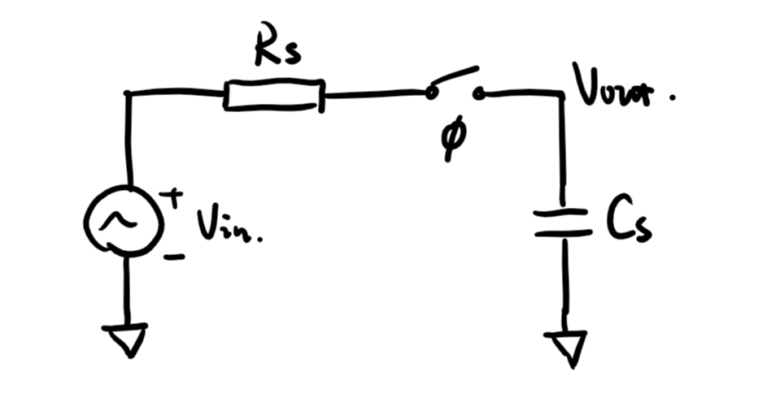
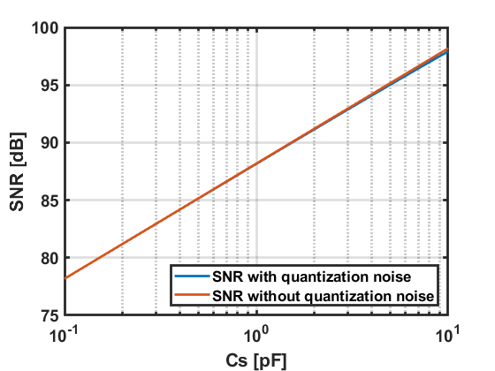

# Turtle

> 用于存放计算**Turtle**相关参数的repository;

[TOC]

## :clipboard: Todo-List

- [x] 完成对采样电容的计算——`Cap_Sample.mlx`；
- [x] 完成对自举开关的模型计算；
- [ ] 完成输出结果的处理代码；

## :maple_leaf: Archive

### 1. Cap_Sample

采样的热噪声是决定ADC信噪比的决定性因素，基于以上的采样模型，输出噪声的有效值为：

$$
V_{\mathrm{out}, \mathrm{rms}}=\sqrt{\left(\frac{k_{b} T}{C_{s}}\right)}, \text { where } k_{b}=1.38 \times 10^{-23} \mathrm{~J} / \mathrm{K}
$$

因此ADC的信噪比可以表达为：

$$
\text{SNR}=\frac{V_{\text {in, rms }}^{2}}{V_{\text {out, rms }}^{2}}=\frac{V_{\text {in, rms}}^{2}}{2 \times\left(k_{b} T / C_{s}\right)}=\frac{\left(V_{\text{DD}} / \sqrt{2}\right)^{2} \times C_{s}}{2 \times k_{b} T}
$$

取对数后可以简化为：

$$
\text{SNR} = 10 \log_{10}\left(C_{S} \right) + 20 \log_{10}\left(V_{\text{DD}}\right) + C
$$

根据信噪比的要求（$\text{SNR > 80dB}$），稍微拉高标准为86dB，**计算得到采样电容大于0.607pF**；

